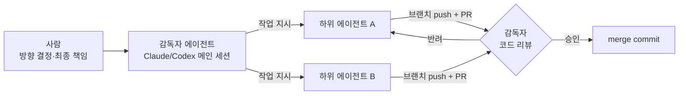
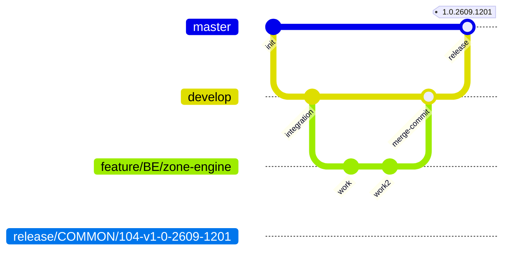
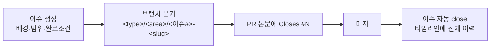
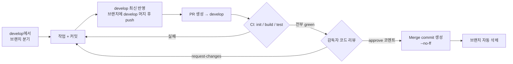
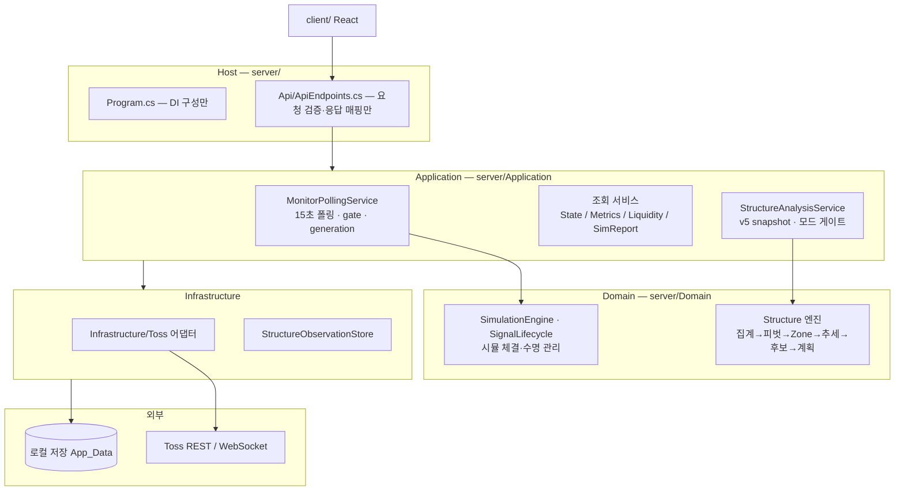

# NqWithAstara — 개발 가이드

미국 정규장 관심종목의 실시간 신호·시뮬레이션 로컬 앱 (.NET 9 + React/Vite + Toss Open API).
이 문서는 **개발자·에이전트(Claude/Codex)가 공유하는 단일 컨벤션 문서**다. 여기 없는 규칙은 규칙이 아니다.

---

## 1. 역할 체계



- 하위 에이전트가 개발하고, **감독자(메인 에이전트)는 설계·지시·리뷰만 한다.** 감독자가 직접 코드를 작성하지 않는다 — 단 리뷰는 diff를 직접 읽는다.
- CI 통과는 머지의 **필요조건이지 충분조건이 아니다.** 리뷰 없이 머지 금지.
- 하위 에이전트 모델 등급: 설계 판단이 필요한 구현은 상위 모델, DTO·문구·단순 반복은 하위 모델. 사용량 70% 초과 시 하위 모델로 내린다. (Claude: opus/sonnet, Codex: 자체 등급 — 세부는 로컬 `AGENTS.md`)
- 반복 절차(하위 에이전트 작업·머지·릴리즈)는 스킬로 고정해 사용한다. 절차를 바꾸면 스킬을 먼저 고친다.

## 2. 브랜치 전략



| 브랜치 | 역할 | 규칙 |
|---|---|---|
| `master` | 릴리즈 | `release/*` PR만 받는다. develop을 직접 머지하지 않는다 |
| `develop` | 통합 (기본 브랜치) | 모든 작업 PR의 대상. **직접 push 금지 — 무조건 브랜치를 딴다** |
| 작업 브랜치 | 단위 작업 | 항상 최신 `develop`에서 분기 |

### 브랜치 이름 — CI가 정규식으로 강제

```text
<type>/<area>/<slug>
```

| 요소 | 허용 값 |
|---|---|
| `type` | `feature` `fix` `refactor` `release` `test` `ci` `docs` `chore` |
| `area` | `BE` `FE` `COMMON` |
| `slug` | 소문자 kebab-case (`[a-z0-9]+(-[a-z0-9]+)*`) |

예: `feature/FE/structure-chart` · `fix/BE/polling-timeout` · `test/BE/30-structure-bottleneck-verification` · `release/COMMON/v1-2-0` (master 대상 PR은 `release/*`만 허용)

## 3. 커밋 컨벤션 + 에이전트 구분자

### 커밋 제목

```text
<type>(<AREA>): <한 줄 요약> [<agent>]
```

- `type`/`AREA`는 브랜치와 동일한 어휘.
- **`[<agent>]` 태그는 자동화 에이전트가 만든 커밋에 필수**: `[claude]` 또는 `[codex]`. 사람이 직접 만든 커밋은 태그를 생략한다.

### 커밋 트레일러 (본문 마지막)

```text
Agent: claude            # 또는 codex — 에이전트 커밋 필수 (기계 판독용)
Co-Authored-By: ...      # 각 도구의 기본 서명은 그대로 유지
```

예시:

```text
fix(BE): CI 아티팩트 실행에서 v5 소스 스캔 경로 해석 실패 수정 [claude]

ServerRoot()가 BaseDirectory 상위만 탐색해 artifacts 실행 시 서버 루트를 찾지 못했다.
각 상위 디렉터리의 server/ 하위도 함께 확인한다.

Agent: claude
Co-Authored-By: Claude Fable 5 <noreply@anthropic.com>
```

### PR·리뷰·머지의 주체 표기

| 시점 | 표기 (PR 코멘트/본문) |
|---|---|
| PR 생성 | 본문 마지막 줄 `Agent: claude` 또는 `Agent: codex` (사람이 열면 생략) |
| 리뷰 | `review by <agent>: approve` 또는 `review by <agent>: request-changes — <사유>` |
| 머지 | `merged by <agent> — CI green + review approved` |

단일 GitHub 계정 환경이라 공식 approve 버튼 대신 **위 코멘트가 리뷰 증적**이다.

## 3.5 이슈 워크플로우 (작업 히스토리의 시작점)

**모든 작업은 이슈에서 시작한다.** 이슈 없이 브랜치 만들지 않는다.



| 규칙 | 내용 |
|---|---|
| 이슈 제목 | `[영역] 요약` — 본문에 배경 / 작업 범위 / 완료 조건 |
| 라벨 | 아래 라벨 체계에서 성격·영역·도메인 선택. 에이전트 작업이면 `agent:claude`/`agent:codex` |
| 마일스톤 | 해당 주차 마일스톤 배정 — **주간, 월요일 시작**, 제목 `2026-Wnn (MM/DD ~ MM/DD)`. 없으면 생성 |
| **어싸인** | **항상 `hyunpaper`** (에이전트는 계정을 공유하므로 주체 구분은 라벨·`Agent:` 표기로) |
| 브랜치 | slug 앞에 이슈 번호: `refactor/COMMON/8-issue-workflow-docs` |
| **진행 표시** | 작업을 시작하면 이슈에 **`Doing` 라벨**을 단다. 머지·close 시 제거 |
| PR | 본문에 `Closes #N` — develop 머지 시 이슈 자동 close. **master 대상(release) PR은 자동 close되지 않으므로 수동으로 닫고 완료 코멘트를 남긴다** |

### 라벨 체계

| 분류 | 라벨 |
|---|---|
| 성격 | `bug` `feature` `refactor` `test` `ci` `docs` `chore` `hotfix` |
| 영역 | `BE` `FE` `COMMON` |
| 도메인 | `structure-engine` `simulation` |
| 메타 | `priority-high` `blocked` `Doing` `agent:claude` `agent:codex` |

성격 라벨과 브랜치 `type`은 별개 축이다 (예: `bug` 이슈 → `fix/...` 브랜치). 라벨 중복 금지 — 같은 의미의 라벨을 새로 만들지 않는다.

## 3.6 주석 컨벤션

- **테스트 파일에는 주석을 달지 않는다.** 의도는 테스트 이름으로 표현한다.
- 일반 코드 주석은 **짧게** 쓴다. 설계 근거·문서 인용을 장문으로 달지 않는다.
- 변경 사유·설계 판단은 커밋 메시지와 PR 본문에 쓴다 (§3 커밋 컨벤션 참고).
- `<summary>`는 한 줄 + `(§번호, #이슈)`까지. 대안 기각 사유·장문 근거는 커밋·PR 본문에 쓴다.

## 4. PR → CI → 리뷰 → 머지 파이프라인



### 머지 규칙

- **Merge commit(Create a merge commit)만 사용한다.** rebase·squash 금지 (저장소 설정으로 비활성화됨). 그래프에 브랜치 가지와 머지 지점이 그대로 남는다. 머지 커밋 제목은 PR 제목이 자동 사용된다.
- CI 3단계 전부 통과 + **감독자 리뷰 approve 코멘트** 없이는 머지하지 않는다.
- **머지 직전 develop 최신성 확인**: 브랜치의 merge-base가 `origin/develop` HEAD와 다르면 **그 브랜치의 worktree에서** develop을 머지(`chore(AREA): develop 머지 [agent]`)하고 CI를 다시 돈 뒤 머지한다. 병렬 에이전트가 먼저 머지한 변경을 놓치지 않기 위함. rebase는 쓰지 않는다.
- CI `cancelled`는 `failure`가 아니다 — 재실행 후 판단한다.
- 머지 후 작업 브랜치는 삭제된다 (원격 자동 + **로컬도 즉시 삭제**, `git fetch --prune`). worktree도 함께 제거.
- 작업 종료 시 로컬 작업 사본은 항상 `develop` 체크아웃 + 최신 pull 상태로 복귀한다.

### 릴리즈

- `develop` → `release/COMMON/<이슈#>-v1-0-YYMM-DD##` → `master` PR (merge commit) → 머지 커밋에 태그. master를 develop으로 역머지하지 않는다 — develop이 통합 히스토리의 기준이다.
- 버전 **`1.0.YYMM.DD##`** — 1.0 고정 + 연월 + 일 + 당일 차수(00부터). 예: `1.0.2609.1201` = 2026-09-12 두 번째 릴리즈.
- 운영 빌드는 **별도 worktree**(`Astra-release-<태그>`)에서 `dotnet publish` — 실행 중 서비스가 bin을 잠근다.
- **`StructurePolicy` 필드를 추가·변경한 릴리즈는 정규장 밖에서만 배포한다.** PolicyHash가 바뀌면 구조 엔진 래치(쿨다운·중복 방지 키)가 세션 중 리셋된다.
- 절차 세부는 `astra-release` 스킬.

### 커밋 단위 (granularity)

- **커밋은 기능/수정의 논리 단위로 분리한다.** 예: 리뷰 지적 3건이면 3커밋, "기능 구현 + 관련 테스트"는 한 커밋. 한 PR에 여러 커밋 권장 — merge commit 방식이라 가지 안의 커밋들이 히스토리에 그대로 보인다.
- WIP·오타 수정 같은 잡커밋(fixup)은 머지 전에 정리한다 (머지 전 작업 브랜치에서는 rebase/force-push 허용).

## 4.5 에이전트 작업 규칙 (병렬 안전)

저장소 체크아웃(`Desktop/Astra`)은 **저장소이면서 동시에 운영 데이터 폴더**다(`App_Data/`·`appsettings.json`·`.runtime/`). 운영 서비스가 이 폴더를 CWD로 쓴다.

| 규칙 | 이유 |
|---|---|
| 이슈별 **worktree**에서 작업한다: `git worktree add ../Astra-wt-<이슈#> <브랜치>` | 메인 체크아웃에서 `git switch`하면 운영 폴더가 바뀐다. 병렬 에이전트 간 충돌 방지 |
| **`git stash` 금지** | stash 참조는 worktree 전체가 공유한다 — 다른 에이전트의 stash를 pop하는 사고가 실제로 났다. 임시 저장이 필요하면 WIP 커밋 후 머지 전 정리 |
| **`git clean -fdx` 금지** | gitignore된 운영 데이터를 지운다 |
| 권한 차단된 명령을 **우회하지 않는다** (예: `git credential fill` 차단 시 다른 자격증명 경로 탐색 금지) | 차단은 의도다. 멈추고 감독자에게 보고 |
| 브랜치 최신화는 **그 브랜치의 worktree 안에서** develop을 머지 | 다른 worktree에 체크아웃된 브랜치를 건드리면 로컬 develop이 오염된다 |
| 작업 완료 후 worktree·로컬 브랜치를 삭제 | 누적된 worktree가 다음 작업의 stash·빌드 잠금 사고를 만든다 |

## 5. 아키텍처



**의존 방향 (테스트로 강제 — ArchitectureBoundaryTests)**: `Host → Application → Domain`. Domain은 HTTP·파일·DI·시계 조회에 의존하지 않는다 (asOf/policy 명시 전달).

### 구조 엔진 롤아웃 (`StructureEngineMode`)

| 모드 | 동작 |
|---|---|
| `off` (기본) | 구조 엔진 비활성 |
| `shadow` | 관측 전용 — simtrades/positions/알림에 **무쓰기** (바이트 동일성 테스트로 증명) |
| `active` | 구조 엔진이 신규 진입 소유. 이미 열린 거래는 체결 시점의 FrozenPlan대로 청산 |

- 운영은 `active`. **v4(점수 엔진) 진입 생성과 화면 표시는 제거됐다** — 대시보드·시그널 순위·거래 표는 v5 단독. v4 코드는 청산 경로에서만 레거시로 남는다.
- 구조 근거가 없으면 **진입 보류가 정답** — ATR 배수/1.5R 폴백으로 목표·손절을 만들지 않는다.
- 구조 엔진 소스는 레거시 진입점(`MarketRules.Enter`/`PriceLevels.*` 등)을 참조하지 않는다 (정적 테스트로 강제).
- `StructurePolicy.RoundTripFeePercent`를 바꾸면 PolicyHash가 바뀌어 래치가 리셋되므로, 정규장 밖에서만 재기동한다.

### 뉴스 감성 (선택 기능, Ollama 필요)

- `News:Enabled`(기본 `false`)를 켜면 60초 주기로 saveticker 목록을 증분 수집해 로컬 Ollama(`qwen2.5:7b-instruct`)로 호재/악재를 분류하고 `App_Data/news/<날짜>.jsonl`에 남긴다.
- 새 기사는 매칭 여부와 무관하게 전부 분류하되 관심종목 매칭 기사가 큐에서 앞서고, 종목이 없는 거시 뉴스는 `MARKET` 의사 심볼로 모인다. `GET /api/news`·`GET /api/news/sentiment`로 조회한다.
- **표시·관측 전용이며 v5 진입 판정에 연결되지 않는다.** `Enabled=false`면 피드·Ollama 호출이 전혀 없다.

## 6. 로컬 검증 (PR 전 필수)

CI와 동일 스택: Node.js 22, .NET 9.

```sh
node .github/scripts/repository-policy.mjs                     # 비밀/금지 경로 스캔
node --test .github/scripts/repository-policy.test.mjs
dotnet test server/tests/Astra.Server.Tests.csproj --configuration Release
cd client && npm ci && npm run build && npm test                # vitest + coverage
```

커버리지 목표는 계층별로 다르다. 신규 코드는 테스트를 동반한다.

| 계층 | 목표 |
|---|---|
| 서버 Domain | 95%+ |
| 서버 Application | 85%+ |
| 서버 Infrastructure/Api | 수치 목표 없음 — 계약 테스트(ArchitectureBoundary·HostContract)로만 검증 |
| 클라이언트 로직 모듈(`structureTypes`·`structureSort`·`alertPlanner`·`dashboardTypes`·`viewRoute`) | 100% |
| 클라이언트 렌더 컴포넌트(`App.tsx`·`StructureChart.tsx`) | 커버리지 목표 제외 |

스모크성 인프라 테스트는 커버리지 수치 확보 목적으로 추가하지 않는다.

앱 실행/종료 스크립트는 로컬 전용이며 저장소에 포함하지 않는다 (`/scripts/`는 gitignore).

## 7. 커밋 금지 대상

`.gitignore` + `.github/scripts/repository-policy.mjs`(CI에서 실행)가 이중으로 막지만, 규칙으로도 명시한다:

| 분류 | 대상 |
|---|---|
| 자격증명 | `tossapi.txt` `tossss.txt` `.env*` `*.pem` `*.key`, 모든 토큰 문자열 |
| 런타임 데이터 | `App_Data/` `.runtime/` 로그 |
| 로컬 설정 | `appsettings*.json` (**`appsettings.example.json`만 커밋**) |
| 산출물 | `bin/` `obj/` `dist/` `node_modules/` `TestResults/` |
| 작업 문서 | `WORK-LOG*.md` `ITERATIONS.md` `STRUCTURE-ENGINE-*.md` `REVIEW-*.md` `ARCHITECTURE.md` `research/` 등 로컬 개발 로그 |
| 에이전트 운영 문서 | `AGENTS.md` `AGENT-WORKFLOW.md` `CODEX-HANDOFF.md` `CONVENTION-CHANGELOG.md` `LOGIC-INTERACTION-REVIEW-*.md` (`.git/info/exclude`로 제외 — 설계·결정 기록은 여기, 규칙은 이 README) |
| 로컬 런처 | `*.cmd` |
| 에이전트 상태 | `.claude/` `.codex/` `.ai/` 등 |

테스트는 라이브 외부 API에 의존하면 안 된다 (fake gateway/TimeProvider 사용).
