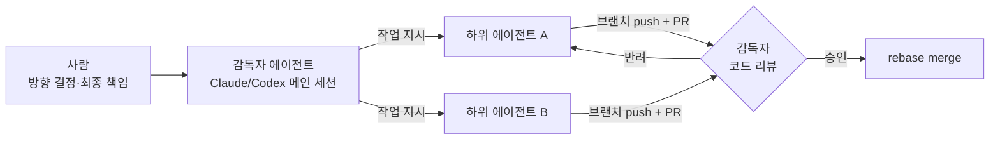
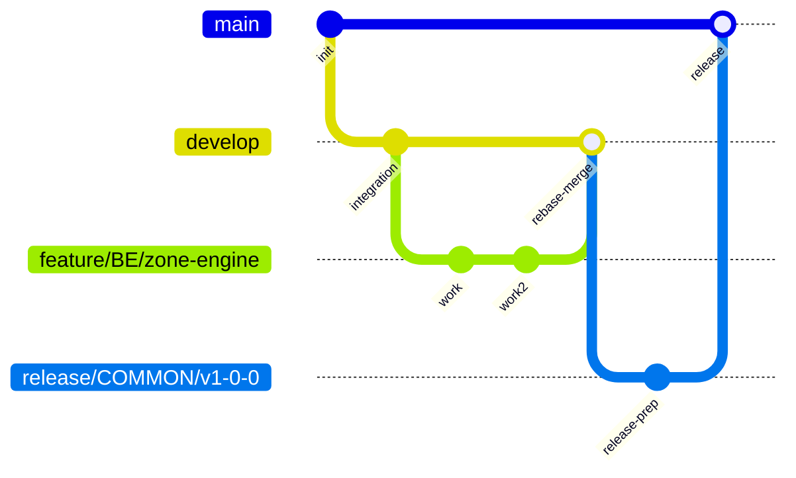
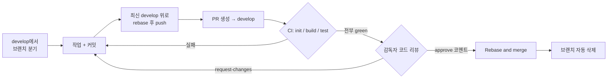
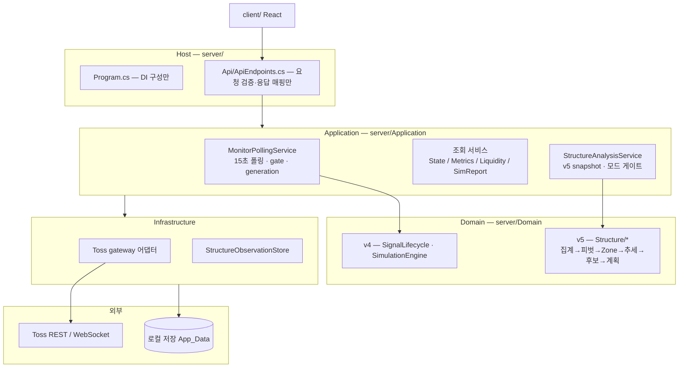

# NqWithAstara — 개발 가이드

미국 정규장 관심종목의 실시간 신호·시뮬레이션 로컬 앱 (.NET 9 + React/Vite + Toss Open API).
이 문서는 **개발자·에이전트(Claude/Codex)가 공유하는 단일 컨벤션 문서**다. 여기 없는 규칙은 규칙이 아니다.

---

## 1. 역할 체계



- 하위 에이전트가 개발하고, **감독자(메인 에이전트)는 코드를 직접 읽고 리뷰한다.**
- CI 통과는 머지의 **필요조건이지 충분조건이 아니다.** 리뷰 없이 머지 금지.

## 2. 브랜치 전략



| 브랜치 | 역할 | 규칙 |
|---|---|---|
| `master` | 릴리즈 | `release/*` PR만 받는다. develop을 직접 머지하지 않는다 |
| `develop` | 통합 (기본 브랜치) | 모든 작업 PR의 대상. **직접 push 금지 — 무조건 브랜치를 딴다** |
| 작업 브랜치 | 단위 작업 | 항상 최신 `develop`에서 분기 |

### 브랜치 이름 — CI가 정규식으로 강제

```text
<type>/<area>/<slug>
```

| 요소 | 허용 값 |
|---|---|
| `type` | `feature` `fix` `refactor` `release` |
| `area` | `BE` `FE` `COMMON` |
| `slug` | 소문자 kebab-case (`[a-z0-9]+(-[a-z0-9]+)*`) |

예: `feature/FE/structure-chart` · `fix/BE/polling-timeout` · `release/COMMON/v1-2-0`

## 3. 커밋 컨벤션 + 에이전트 구분자

### 커밋 제목

```text
<type>(<AREA>): <한 줄 요약> [<agent>]
```

- `type`/`AREA`는 브랜치와 동일한 어휘.
- **`[<agent>]` 태그는 자동화 에이전트가 만든 커밋에 필수**: `[claude]` 또는 `[codex]`. 사람이 직접 만든 커밋은 태그를 생략한다.

### 커밋 트레일러 (본문 마지막)

```text
Agent: claude            # 또는 codex — 에이전트 커밋 필수 (기계 판독용)
Co-Authored-By: ...      # 각 도구의 기본 서명은 그대로 유지
```

예시:

```text
fix(BE): CI 아티팩트 실행에서 v5 소스 스캔 경로 해석 실패 수정 [claude]

ServerRoot()가 BaseDirectory 상위만 탐색해 artifacts 실행 시 서버 루트를 찾지 못했다.
각 상위 디렉터리의 server/ 하위도 함께 확인한다.

Agent: claude
Co-Authored-By: Claude Fable 5 <noreply@anthropic.com>
```

### PR·리뷰·머지의 주체 표기

| 시점 | 표기 (PR 코멘트/본문) |
|---|---|
| PR 생성 | 본문 마지막 줄 `Agent: claude` 또는 `Agent: codex` (사람이 열면 생략) |
| 리뷰 | `review by <agent>: approve` 또는 `review by <agent>: request-changes — <사유>` |
| 머지 | `merged by <agent> — CI green + review approved` |

단일 GitHub 계정 환경이라 공식 approve 버튼 대신 **위 코멘트가 리뷰 증적**이다.

## 4. PR → CI → 리뷰 → 머지 파이프라인



### 머지 규칙

- **Rebase and merge만 사용한다.** merge commit·squash 금지 (저장소 설정으로 비활성화됨).
- CI 3단계 전부 통과 + **감독자 리뷰 approve 코멘트** 없이는 머지하지 않는다.
- 릴리즈: `develop` → `release/<area>/<slug>` 브랜치 → `master` PR. rebase로 master 해시가 바뀌므로 **master를 develop으로 역머지하지 않는다** — develop이 유일한 통합 히스토리다.
- 머지 후 작업 브랜치는 삭제된다 (자동).

## 5. 아키텍처



**의존 방향 (테스트로 강제 — ArchitectureBoundaryTests)**: `Host → Application → Domain`. Domain은 HTTP·파일·DI·시계 조회에 의존하지 않는다 (asOf/policy 명시 전달).

### v4 / v5 공존 규칙

| 모드 (`StructureEngineMode`) | 신규 진입 소유 | v5 동작 |
|---|---|---|
| `off` (기본) | v4 | 계산 없음 |
| `shadow` | v4 | 관측만 — simtrades/positions/알림에 **무쓰기** (바이트 동일성 테스트로 증명) |
| `active` | v5 | v4 OPEN은 기존 청산 정책 유지 |

- v5는 구조 근거 없으면 **진입 보류가 정답** — ATR 배수/1.5R 폴백으로 목표·손절을 만들지 않는다.
- v5 소스는 v4 진입점(`MarketRules.Enter`/`PriceLevels.*` 등)을 참조하지 않는다 (정적 테스트로 강제).

## 6. 로컬 검증 (PR 전 필수)

CI와 동일 스택: Node.js 22, .NET 9.

```sh
node scripts/repository-policy.mjs                     # 비밀/금지 경로 스캔
node --test scripts/repository-policy.test.mjs
dotnet test server/tests/Astra.Server.Tests.csproj --configuration Release
cd client && npm ci && npm run build
```

앱 실행/종료: `scripts/Start-Astra.ps1` / `scripts/Stop-Astra.ps1` (로컬 전용).

## 7. 커밋 금지 대상

`.gitignore` + `scripts/repository-policy.mjs`(CI에서 실행)가 이중으로 막지만, 규칙으로도 명시한다:

| 분류 | 대상 |
|---|---|
| 자격증명 | `tossapi.txt` `tossss.txt` `.env*` `*.pem` `*.key`, 모든 토큰 문자열 |
| 런타임 데이터 | `App_Data/` `.runtime/` 로그 |
| 로컬 설정 | `appsettings*.json` (**`appsettings.example.json`만 커밋**) |
| 산출물 | `bin/` `obj/` `dist/` `node_modules/` `TestResults/` |
| 작업 문서 | `WORK-LOG*.md` `ITERATIONS.md` `STRUCTURE-ENGINE-*.md` `REVIEW-*.md` `research/` 등 로컬 개발 로그 |
| 로컬 런처 | `*.cmd` |
| 에이전트 상태 | `.claude/` `.codex/` 등 |

테스트는 라이브 외부 API에 의존하면 안 된다 (fake gateway/TimeProvider 사용).
